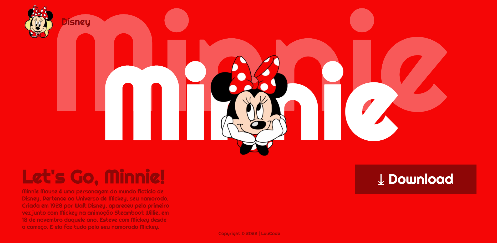

 # Landing Page - Let's Go, Minnie

 

[Clique aqui](https://luanabarbosa07/WebSites/edit/main/landingPageResponsivaMinnie/) para acessar o projeto.
 ---
 ## Sobre
 Site do tipo landing page para divulgar a personagem que minha filha gosta Let's Go, Minnie.
 O intuito deste projeto é colocar em prática o conhecimento adquirido sobre as linguagens de marcação, HTML, CSS e Markdown.

 ---
 ## Tencologias utilizadas
 - HTML
 - CSS
 - Responsividade
 - Markdown

 ---
 ## Autor

 - [Luana Barbosa](https://github.com/luanabarbosa07/)

 ## RedesSocial

 - [_LuuCode](https://www.instagram.com/_luucode/)
